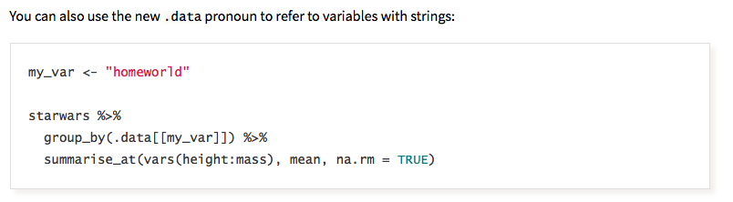

## Introduction

[`seplyr`](https://github.com/WinVector/seplyr) is an [`R`](https://www.r-project.org) package that makes it easy to program over [`dplyr` `0.7.*`]( https://CRAN.R-project.org/package=dplyr).

To illustrate this we will work an example.

Suppose you had worked out a `dplyr` pipeline that performed an analysis you were interested in.  For an example we could take something similar to one of the examples from the [`dplyr` `0.7.0` announcement](https://blog.rstudio.com/2017/06/13/dplyr-0-7-0/).

```{r exi}
suppressPackageStartupMessages(library("dplyr"))
packageVersion("dplyr")

colnames(starwars)

starwars %>%
  group_by(homeworld) %>%
  summarise(mean_height = mean(height, na.rm = TRUE),
            mean_mass = mean(mass, na.rm = TRUE),
            count = n()) 
```

The above is colloquially called "an interactive script."  The name comes from the fact that we directly use names of variables (such as "`homeworld`", which would only be known from looking at the data directly) in our analysis code.  Only somebody interacting with the data could write such a script (hence the name).

It has long been considered a point of discomfort to convert such an interactive `dplyr` pipeline into a re-usable script or function.  That is a script or function that specifies column names in some [parametric](http://www.win-vector.com/blog/2017/04/programming-over-r/) or re-usable fashion. Roughly it means the names of the data columns are not yet known when we are writing the code (and this is what makes the code re-usable).

This inessential (or conquerable) difficulty is largely a due to the strong preference for [non-standard evaluation interfaces](http://adv-r.had.co.nz/Computing-on-the-language.html) (that is interfaces that capture and inspect un-evaluated expressions from their calling interface) in the design `dplyr`.  The common tooling to work around `dplyr`'s non-standard interfaces is a system called alternately `rlang` (a name which is perhaps a bit overly ambitious as `rlang` is not the `R` language) or tidyeval (a name which is perhaps a bit derogatory, incorrectly labeling `R` itself as the "non-tidy" dialect relative to tidyeval).  We, on the other hand, recommend using either the superior tooling offered by [`wrapr::let()`](https://winvector.github.io/wrapr/reference/let.html) (which actual pre-dates `rlang` and can be used with any package, not just those that are designed around it) or to avoid non-standard interface foibles by using a standard evaluation adapter for `dplyr` called [`seplyr`]( https://CRAN.R-project.org/package=seplyr) (which we will discuss here).

Our contention is a dialect (or adaption) of `dplyr` itself (which we call `seplyr` for "standard evaluation plyr") that emphasizes standard (or value carrying) interfaces is easy to use and does not require the complexities of `rlang` (as `seplyr` fails to introduce the difficulty `rlang` is designed to feast on).

## `seplyr`

`seplyr` is a `dplyr` adapter layer that prefers "slightly clunkier" standard interfaces (or [referentially transparent](https://en.wikipedia.org/wiki/Referential_transparency) interfaces), which are actually very powerful and can be used to some advantage.

The above description and comparisons can come off as needlessly broad and painfully abstract.  Things are much clearer if we move away from theory and return to our example.

Let's translate the above example into a re-usable function in small (easy) stages.  First translate the interactive script from `dplyr` notation into `seplyr` notation.  This step is a pure [re-factoring](https://en.wikipedia.org/wiki/Code_refactoring), we are changing the code without changing its observable external behavior.

The translation is mechanical in that it is mostly using `seplyr` documentation as a lookup table.  What you have to do is:

 * Change `dplyr` verbs to their matching `seplyr` "`*_se()`" adapters.
 * Add quote marks around names and expressions.
 * Convert sequences of expressions (such as in the `summarize()`) to explicit vectors by adding the "`c()`" notation.
 * Replace "`=`" in expressions with "`:=`".
 
Our converted code looks like the following.


```{r exc}
library("seplyr")

starwars %>%
  group_by_se("homeworld") %>%
  summarize_se(c("mean_height" := "mean(height, na.rm = TRUE)",
                 "mean_mass" := "mean(mass, na.rm = TRUE)",
                 "count" := "n()"))
```

This code works the same as the original `dplyr` code.  Also the translation could be performed by following the small set of explicit re-coding rules that we gave above.

Obviously at this point all we have done is: worked to make the code a bit less pleasant looking. We have yet to see any benefit from this conversion (though we can turn this on its head and say all the original `dplyr` notation is saving us is from having to write a few quote marks).

The benefit is: this new code can *very easily* be parameterized and wrapped in a re-usable function.  In fact it is now simpler to do than to describe.


```{r exp3}
grouped_mean <- function(data, 
                         grouping_variables, 
                         value_variables,
                         count_name = "count") {
  result_names <- paste0("mean_", 
                         value_variables)
  expressions <- paste0("mean(", 
                        value_variables, 
                        ", na.rm = TRUE)")
  calculation <- result_names := expressions
  data %>%
    group_by_se(grouping_variables) %>%
    summarize_se(c(calculation,
                   count_name := "n()")) %>%
    ungroup()
}

starwars %>% 
  grouped_mean(grouping_variables = c("eye_color", "skin_color"),
               value_variables = c("mass", "birth_year"))
```

We have translated our original interactive or ad-hoc calculation into a parameterized reusable function in two easy steps:

  * Translate into \code{seplyr} notation.
  * Replace values with variables.
  
To be sure: there are some clunky details of using \code{paste0()} to build up the expressions, but the conversion process is very regular and easy. In `seplyr` parametric programming is intentionally easy (just replace values with variables).  


## `rlang`/tidyeval

The above may all seem academic as "`dplyr` supplies its own parametric abstraction layer: `rlang`/tidyeval."  However, in our opinion `rlang` abstraction is irregular and full of corner cases (even for simple column names).  When you are programming of `rlang` you are programming over a language that is not quite `R`, and a language that is not in fact superior to `R`. Take for example the following example from the [`dplyr` `0.7.0` announcement](https://blog.rstudio.com/2017/06/13/dplyr-0-7-0/):



The above code appears to work, unless you take the extra steps of actually running it and examining the results.

```{r rlde1}
packageVersion("dplyr")
packageVersion("rlang")
packageVersion("tidyselect")

my_var <- "homeworld"

starwars %>%
  group_by(.data[[my_var]]) %>%
  summarise_at(vars(height:mass), mean, na.rm = TRUE)
```

Notice the created grouping column is called "`my_var`", and *not* "`homeworld`".  This may *seem* like a small thing, but it will cause any downstream processing to fail.  One can try variations and get many different results, some of which are correct and some of which are not.

```{r rlde2}
# wrong
starwars %>%
  group_by(!!my_var) %>%
  summarise_at(vars(height:mass), mean, na.rm = TRUE)
```


```{r rlde3}
# correct, or at least appears to work
starwars %>%
  group_by(!!rlang::sym(my_var)) %>%
  summarise_at(vars(height:mass), mean, na.rm = TRUE)
```

```{r rlde4}
# correct, or at least appears to work
starwars %>%
  group_by(.data[[!!my_var]]) %>%
  summarise_at(vars(height:mass), mean, na.rm = TRUE)
```

```{r rlde5, error=TRUE}
# errors-out
starwars %>%
  group_by(.data[[!!rlang::sym(my_var)]]) %>%
  summarise_at(vars(height:mass), mean, na.rm = TRUE)
```

Notice above in some places strings are required and in others names or symbols are required.  In some contexts one may substitute for the other, and in some contexts they can not. In some situations "`!!`" must be used, and in others it must not be used. In some situations "`rlang::sym()`" must be used, and in some situations it must not be used.  In some situations errors are signaled, and in others a bad result is quietly returned.

The details above are [possibly teachable](https://dplyr.tidyverse.org/articles/programming.html) (in the sense one can rote memorize them, once APIs stabilize and stop changing), but they are not friendly to exploration or discoverable.  There are a needlessly large number of moving pieces (strings, names, symbols, quoting, quosures, de-quoting, "data pronouns", select semantics, non-select semantics, `=` versus `:=`, and so on) and one is expected to know which combinations of these items work together in which context.

For a further example consider the following.

```{r rdse1, error=TRUE}
# correct, or at least appears to work
starwars %>%
  select(my_var) %>%
  head(n=2)

# errors-out
starwars %>%
  group_by(my_var) %>%
  head(n=2)
```

The "use the value unless the variable name is a column" semantics of select can make code hard to read and potentially unsafe.  
The point is the user does not know what column a `select()` actually chooses unless that know all of:

  * The name of the variable being used (in this case "`my_var`").
  * The value in the variable.
  * If the `data.frame` does or does not have a column matching the variable name.
  
Column-name coincidences are actually likely in re-usable code.  Often when generalizing a sequence of operations,
one often chooses an existing column name as the name of a column control variable.

Let's look at examples.

```{r rdsel2, error=TRUE}
my_var <- "homeworld"
# selects height column
starwars %>%
  select(my_var) %>%
  head(n=2)

# perhaps different data with an extra column
starwars_plus <- starwars %>%
  mutate(my_var = seq_len(nrow(starwars)))

# same code now selects my_var column
starwars_plus %>%
  select(my_var) %>%
  head(n=2)

# original official example code now errors-out
starwars_plus %>%
  group_by(.data[[my_var]]) %>%
  summarise_at(vars(height:mass), mean, na.rm = TRUE)
```


The above *might* be acceptable in interactive work, if we assume the user knows the names of all of the columns in the `data.frame` and
therefore can be held responsible for avoiding column name to variable coincidences. Or more realistically: the user is working 
interactively in the sense they are there to alter and re-run the code if they happen to notice the failure. However, this is not a safe state of
affairs in re-usable functions or packages: which should work even if their are naming coincidences in thought to be irrelevant extra columns.

`rlang` does have methods to write unambiguous code such as in:

```{r rlangu}
starwars %>%
  select(!!my_var) %>%
  head(n=2)
```

However, because the `dplyr` interface does not insist on the "`!!`" notation, the "`!!`" notation will not always be remembered.  `rlang`/tidyeval interfaces tend to be complex and irregular.

The `seplyr::select_se()` interface is intentionally simple and regular: it always looks for columns using the strings (not variable names) given.

```{r sesel}
print(my_var)

# selects homeworld column (the value specified my_var) independent of
# any coincidence between variable name and column names.
starwars_plus %>% 
  select_se(my_var) %>%
  head(n=2)
```

We have found when a programing notation is irregular it discourages exploration and leads to learned helplessness (rote appeals to authority and manuals instead of rapid acquisition of patterns and skills).

## Conclusion

The `seplyr` methodology is simple, easy to teach, and powerful.  

The methodologies we discussed differ in philosophy.

  * `rlang`/tidyeval is often used to build new non-standard interfaces on top of existing non-standard interfaces.  This is needed because non-standard interfaces do not naturally compose.  The tidy/non-tidy analogy is: it works around a mess by introducing a new mess.
  * `wrapr::let()` converts non-standard interfaces into standard [referentially transparent](https://en.wikipedia.org/wiki/Referential_transparency) or value-oriented interfaces.  It tries to help clean up messes.
  * `seplyr` is a demonstration of a possible variation of `dplyr` where more of the interfaces expect values.  It tries to cut down on the initial mess, which in turn cuts down on the need for tools and training in dealing with messes.

The `seplyr` package contains a number of worked examples both in `help()` and [`vignette(package='seplyr')`](https://winvector.github.io/seplyr/articles/seplyr.html) documentation. 


